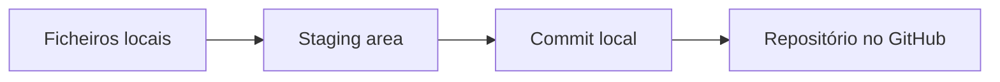

# Guia de Git e GitHub para iniciantes

Este guia explica o processo utilizado na Tarefa 3 da Week 2. O objetivo é permitir que você repita o procedimento sozinha em trabalhos futuros.

## 1. Git e GitHub não são a mesma coisa

**Git** é o sistema instalado no computador que regista alterações feitas nos ficheiros. Ele permite voltar a versões anteriores e verificar quem alterou cada parte do projeto.

**GitHub** é a plataforma online onde um repositório Git pode ser publicado, partilhado e avaliado.

Uma forma simples de pensar é:

- Git = histórico controlado no computador.
- GitHub = cópia online do projeto e do respetivo histórico.



## 2. Conceitos obrigatórios da tarefa

### Repository

É a pasta principal do projeto, juntamente com o histórico criado pelo Git. O repositório deste estágio chama-se `bluestock-data-analyst-internship`.

### Clone

`git clone` copia um repositório existente do GitHub para o computador.

```bash
git clone URL_DO_REPOSITORIO
```

Não usamos `clone` para criar este projeto porque ele começou no computador. O comando será útil quando você quiser trabalhar noutro computador.

### Commit

Um commit é um ponto guardado no histórico. Ele deve representar uma alteração clara, por exemplo: adicionar a tarefa de SQL.

```bash
git add week-1/task-02-sql
git commit -m "feat: add Week 1 SQL analysis"
```

### Push

`git push` envia os commits locais para o GitHub.

```bash
git push origin main
```

### Pull

`git pull` traz para o computador as alterações que já estão no GitHub.

```bash
git pull origin main
```

Use `pull` antes de começar a trabalhar quando o mesmo repositório é utilizado em mais de um computador ou por outras pessoas.

### Branch

Uma branch é uma linha separada de trabalho. Permite testar uma mudança sem alterar imediatamente a versão principal, chamada `main`.

```bash
git switch -c feature/new-analysis
```

Depois de trabalhar:

```bash
git add .
git commit -m "feat: add new analysis"
git push -u origin feature/new-analysis
```

### Pull Request

Uma Pull Request, ou PR, é um pedido para comparar e juntar uma branch à `main`. Normalmente é criada no site do GitHub depois de publicar a branch.

A PR permite:

- explicar o que foi alterado;
- receber comentários;
- verificar conflitos;
- aprovar a mudança antes de incorporá-la ao projeto principal.

## 3. Processo aplicado neste projeto

### Passo 1 - criar a pasta principal

```bash
mkdir bluestock-data-analyst-internship
cd bluestock-data-analyst-internship
```

### Passo 2 - iniciar o Git

```bash
git init -b main
```

Esse comando transforma a pasta normal num repositório Git e define `main` como branch principal.

### Passo 3 - configurar a identidade

O Git precisa do nome e do e-mail que aparecerão nos commits.

```bash
git config user.name "SEU NOME"
git config user.email "SEU EMAIL DO GITHUB"
```

No GitHub, o e-mail pode ser consultado em `Settings > Emails`. Se a privacidade estiver ativada, use o endereço `noreply` fornecido pelo próprio GitHub.

### Passo 4 - verificar os ficheiros

```bash
git status
```

O comando mostra ficheiros novos, alterados ou ainda não guardados num commit.

### Passo 5 - adicionar ficheiros à staging area

```bash
git add README.md .gitignore
```

A staging area é uma área de preparação. `git add` seleciona aquilo que entrará no próximo commit; ainda não cria o commit.

### Passo 6 - criar um commit

```bash
git commit -m "chore: initialize internship repository"
```

Uma boa mensagem de commit deve explicar a mudança de forma curta e concreta.

Prefixos usados neste projeto:

- `feat:` para adicionar uma tarefa ou funcionalidade;
- `docs:` para documentação;
- `fix:` para corrigir um erro;
- `chore:` para configuração e organização.

### Passo 7 - criar o repositório no GitHub

No GitHub:

1. Clique no sinal `+`.
2. Selecione `New repository`.
3. Introduza `bluestock-data-analyst-internship`.
4. Adicione uma descrição curta.
5. Escolha a visibilidade.
6. Não adicione outro README, `.gitignore` ou licença, porque eles já existem localmente.
7. Clique em `Create repository`.

### Passo 8 - ligar o repositório local ao GitHub

Copie o URL fornecido pelo GitHub e execute:

```bash
git remote add origin URL_DO_REPOSITORIO
git remote -v
```

`origin` é o nome convencional utilizado para representar o repositório remoto.

### Passo 9 - publicar o histórico

```bash
git push -u origin main
```

O parâmetro `-u` liga a branch local `main` à branch remota. Nos próximos envios, normalmente será suficiente utilizar `git push`.

## 4. Rotina recomendada para trabalhos futuros

```bash
git pull
git status
git switch -c feature/nome-da-tarefa
# editar ou adicionar os ficheiros
git add .
git commit -m "feat: describe the completed task"
git push -u origin feature/nome-da-tarefa
```

Depois, abra uma Pull Request no GitHub e incorpore a branch à `main` após a revisão.

## 5. Comandos para verificar o trabalho

```bash
git status
git log --oneline --decorate --graph --all
git branch
git remote -v
```

- `git status` verifica alterações por guardar.
- `git log` apresenta o histórico de commits.
- `git branch` mostra as branches.
- `git remote -v` mostra a ligação ao GitHub.

## 6. Erros comuns

### Publicar ficheiros confidenciais

Nunca envie passwords, tokens, API keys ou ficheiros `.env`. O `.gitignore` reduz esse risco, mas você também deve verificar `git status` antes de cada commit.

### Usar `git add .` sem verificar

Esse comando adiciona todas as mudanças. Primeiro use `git status` para garantir que nenhum ficheiro indesejado será incluído.

### Criar apenas um commit para todo o estágio

Isso não demonstra manutenção de histórico. Crie commits separados e significativos para cada tarefa ou grupo lógico de alterações.

### Editar diretamente a main em trabalho de equipa

Em equipas, prefira uma branch e uma Pull Request. Assim, as alterações podem ser revistas antes da integração.

## 7. Resumo mental

1. `pull` - atualizar o computador.
2. criar ou selecionar uma `branch`.
3. trabalhar nos ficheiros.
4. `status` - verificar.
5. `add` - preparar.
6. `commit` - guardar no histórico.
7. `push` - enviar ao GitHub.
8. Pull Request - rever e juntar à `main`.

